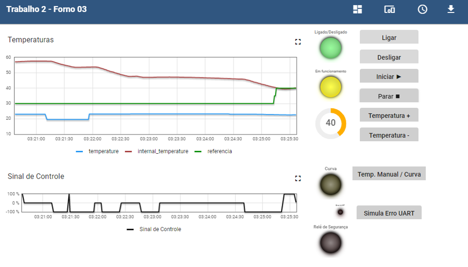
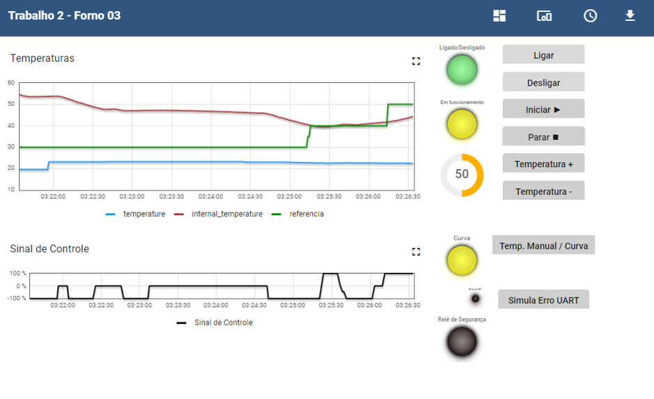
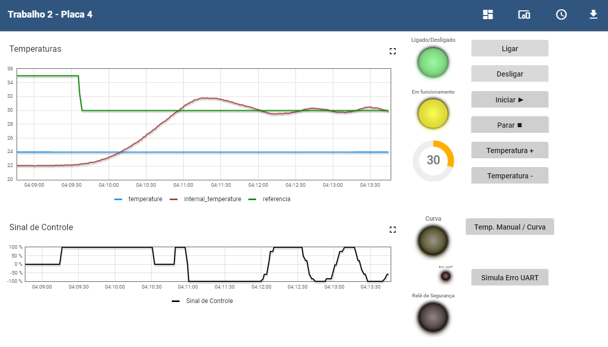

# FSE-Trabalho-2-2022-2
Trabalho 2 da disciplina de Fundamentos de Sistemas Embarcados 2022-2
# Objetivo:
Este trabalho tem por objetivo a implementação de um sistema (que simula) o controle de um forno para soldagem de placas de circuito impresso (PCBs), mais detalhes podem ser encontrados [aqui](https://gitlab.com/fse_fga/trabalhos-2022_2/trabalho-2-2022-2).


# Requisitos:
- Python 3.9.2  
- Dependências:
  - RPi.bme280
  - smbus2
  - wiringpi

# Passos
### Passo 1:
 Caso não possua as dependências descritas acima, instale-as na pasta raiz do projeto utilizando comando abaixo:
```sh
pip3 install -r requirements.txt
```
### Passo 2:
Entre na pasta **src** do projeto e execute o arquivo principal  com o comando abaixo:
```
python3 main.py
```
### Passo 3:
Acesse o Dashboard da placa raspberry escolhida e inicie a interação com o forno.

## Gráficos





1. [RASP 47] Teste realizado no forno 3 .Temperatura interna se aproxima e se mantém próxima da temperatura de referência que foi aumentada para 40 °C via dashboard.


2. [RASP 47]  Temperatura de referência fixada de forma manual em 50 °C, o resistor é acionado para fazer a temperatura interna se aproximar da temperatura de referência.



3. [RASP 42] Também foi realizado teste no forno 4 . A temperatura de referência foi diminuida para 30 °C via dashboard e com o decorrer do tempo a temperatura interna conseguiu acompanhar via acionamento/desligamento de ventoinha/resistor.




